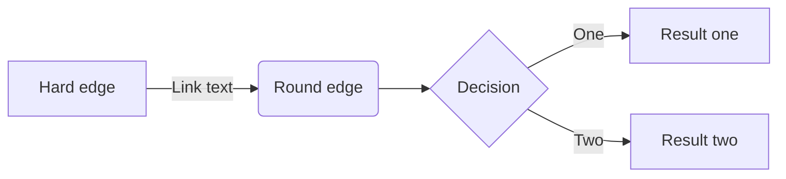
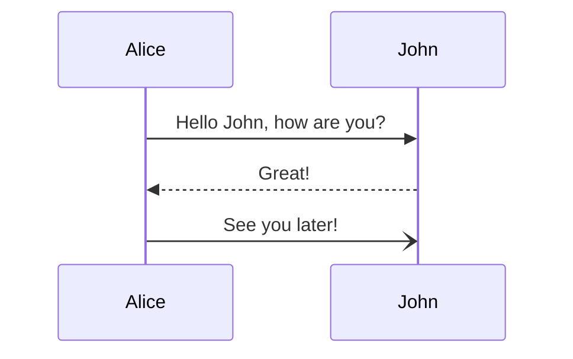
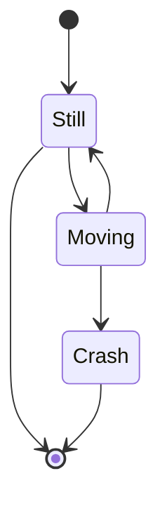
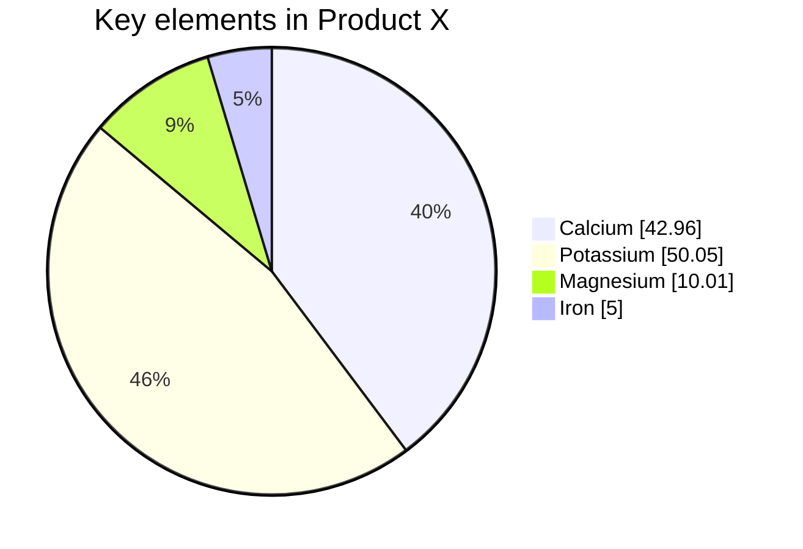

# Title test

Here is a `paragraph` with some unordered list:
* item 1
* item 2

But we can also create ordered lists:
1. ordered 1
2. ordered 2

## Let's do code blocks

```python
my_str = "Hello "
my_str += "World!"
print(my_str)
```

```bash
a="test"
echo $a
```

```console
$ env |grep SHELL
SHELL=/usr/local/bin/bash
PYENV_SHELL=bash
```

## Jekyll spaceship 🚀

### MathJax

> Check [here](https://math.meta.stackexchange.com/questions/5020/mathjax-basic-tutorial-and-quick-reference) for a lot of examples.
{: .prompt-tip }

> Don't forget to end each line of multi-line MathJax with a `double-space`, otherwise, you need to put all code on one line between the 2 `$$`
{: .prompt-warning }

$$ a * b = c ^ b $$

$$ 2^{\frac{n-1}{3}} $$

$$ \int\_a^b f(x)\,dx. $$

$$\sum_{i=0}^n i^2 = \frac{(n^2+n)(2n+1)}{6}$$

$$  
  f(n) =  
\begin{cases}  
n/2,  & \text{if $n$ is even} \\  
3n+1, & \text{if $n$ is odd}  
\end{cases}  
$$


$$  
  \begin{pmatrix}  
    a & b\\  
    c & d\\  
  \hline  
    1 & 0\\  
    0 & 1  
  \end{pmatrix}  
$$


### UML Graph

> Cool cheatsheet [here](https://ogom.github.io/draw_uml/plantuml/)
{: .prompt-tip }


```plantuml!
(*) --> "Find Event"
"Find Event" -> "Attend Event"

if "Capacity?" then
  ->[ok] "Create Ticket"
else
  -->[full] if "Standby?" then
    ->[ok] "Standby Ticket"
  else
    -->[no] "Cancel Ticket"
    "Cancel Ticket" --> (*)
  endif
endif

"Create Ticket" --> ==show==
"Standby Ticket" --> ==show==
==show== --> "Show Ticket"
"Show Ticket" --> (*)
```

```plantuml!
cloud "Cloud" {
  package "Package" {
    [register]
    frame "frame" {
      [backup]
    }
  }
}

node "Node" {
  database "Database" {
    [store]
  }
  folder "Folder" {
    [File]
  }
}

[register] .. [store] : HTTP
[backup] .. [File] : FTP
```

### Mermaid JS

> Official [website](https://mermaid-js.github.io/mermaid/#/) is great ! Plus there is a [Live Editor](https://mermaid-js.github.io/mermaid-live-editor/)
{: .prompt-tip }

> Added the following to `_config.yml` so it uses dark theme:
```yml
  jekyll-spaceship:
  mermaid-processor:
    config:
      theme: dark
```
{: .prompt-tip }  


#### Flowcharts



#### Sequence Diagram



#### State diagram



#### Pie chart

