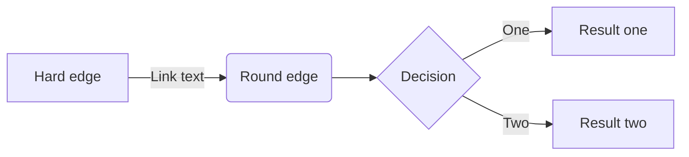
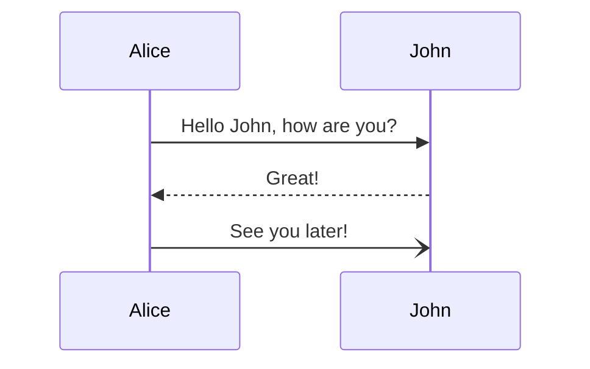
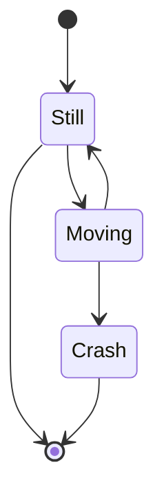
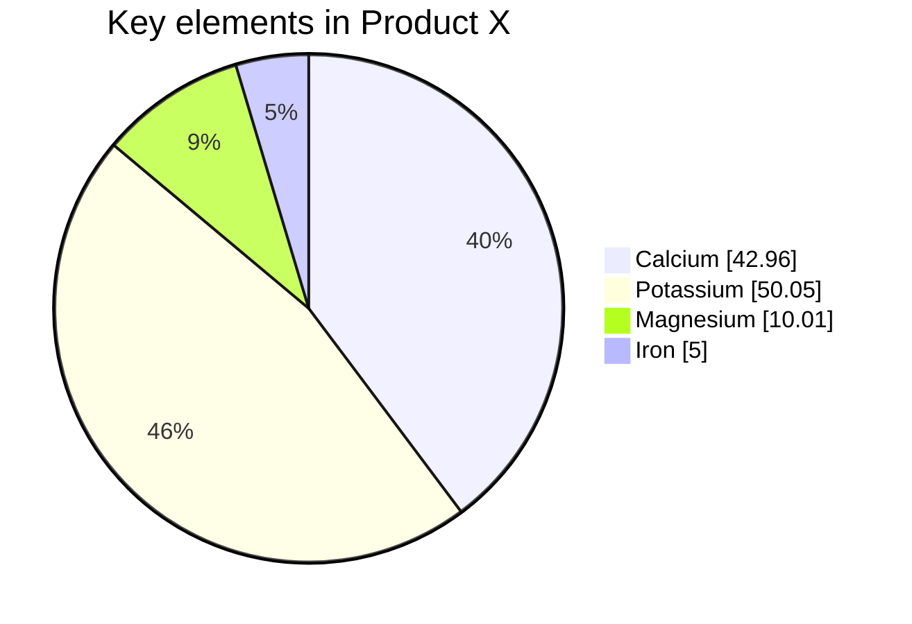

# Title test

Here is a `paragraph` with some unordered list:
* item 1
* item 2

But we can also create ordered lists:
1. ordered 1
2. ordered 2

## Code blocks

```python
my_str = "Hello "
my_str += "World!"
print(my_str)
```

```bash
a="test"
echo $a
```

```console
$ env |grep SHELL
SHELL=/usr/local/bin/bash
PYENV_SHELL=bash
```

## MathJax

> Check [here](https://math.meta.stackexchange.com/questions/5020/mathjax-basic-tutorial-and-quick-reference) for a lot of examples.
{: .prompt-tip }


$$ a * b = c ^ b $$

$$ 2^{\frac{n-1}{3}} $$

$$ \int_a^b f(x)\,dx. $$

$$ \sum_{i=0}^n i^2 = \frac{(n^2+n)(2n+1)}{6} $$

$$
  f(n) =
\begin{cases}
n/2,  & \text{if $n$ is even} \\
3n+1, & \text{if $n$ is odd}
\end{cases}
$$


$$
  \begin{pmatrix}
    a & b\\
    c & d\\
  \hline
    1 & 0\\
    0 & 1
  \end{pmatrix}
$$

## Mermaid JS

> Official [website](https://mermaid-js.github.io/mermaid/#/) is great ! Plus there is a [Live Editor](https://mermaid-js.github.io/mermaid-live-editor/)
{: .prompt-tip }

### Flowcharts



### Sequence Diagram



### State diagram



### Pie chart

